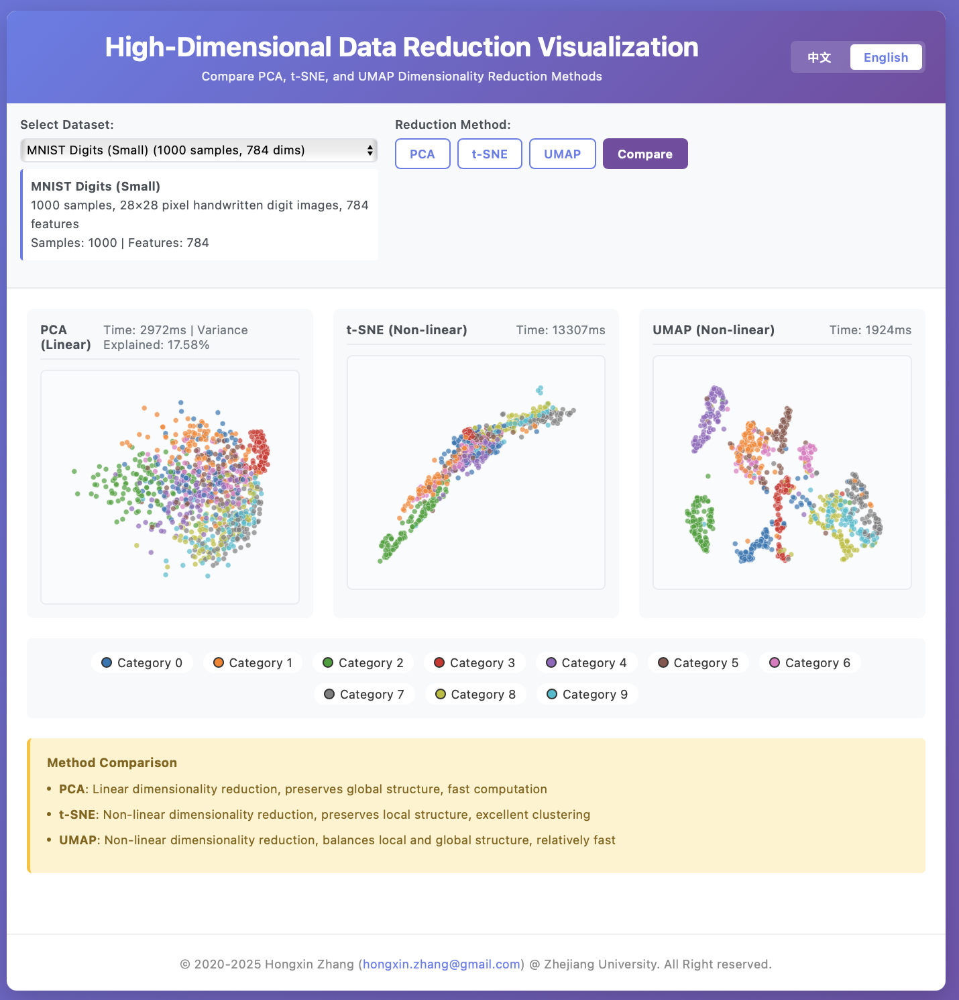
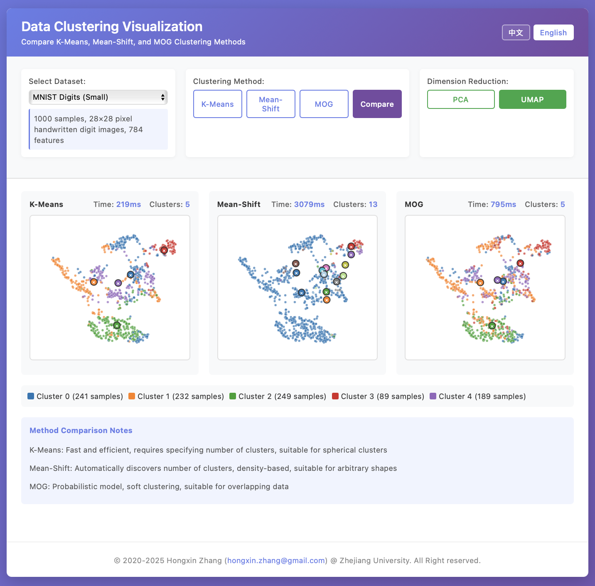

[English](https://github.com/hongxin/vizmodeling/blob/main/README.md) | 中文

# 可视化建模
一个有关可视建模分析的微课程

## 课程资料 
### 2025
- 2025-09-29 [Slides-1](https://github.com/hongxin/vizmodeling/blob/main/2025/vizmodeling-1.pdf)
- 2025-10-09 [Slides-2](https://github.com/hongxin/vizmodeling/blob/main/2025/vizmodeling-2.pdf)

### 2024
- 2024-09-14 [Slides-1](https://github.com/hongxin/vizmodeling/blob/main/2024/vizmodeling-1.pdf)
- 2024-09-19 [Slides-2](https://github.com/hongxin/vizmodeling/blob/main/2024/vizmodeling-2.pdf)

## 简介
本课程的主要授课对象是浙江大学电子信息专业的研究生。

模型是理解和改造世界的关键和支柱，它们体现了人类的智慧和成就。高质量、高可靠性的模型在电子信息和工程技术领域至关重要，它们为优化设计、高效运行和智能控制系统奠定基础。从实验科学通过数据分析和机理理解到精确、规则化的系统结果，模型是唯一的途径。以系统模型为核心，工业软件已成为现代工业文明的驱动力量。

本课程将介绍电子信息专业研究生在建立、分析、模拟、设计、优化和可视化系统方面的基本方法。它探讨了跨领域如工业生产、城市交通管理等动态建模和分析、实验设计和模型分析的共同原则和方法。其目的是帮助学生熟悉各种目的/属性/特征下的不同数学模型，并掌握模型构建、简化、求解和集成的基本方法。

此外，本课程旨在激发学生保持前瞻思维、培养辩证思维、澄清技术逻辑，通过跨学科教育和创新，使学生能够深入探究关键核心技术背后的基本原理，从而为实现科学技术自立自强奠定基础支持。

## 讲者
张宏鑫博士 http://www.cad.zju.edu.cn/home/zhx/

## 助教
 - 王隽曦
 - 吴泓嘉
 - 周榆晰  

## 授课方式
钉钉在线直播

## 演示程序

本课程提供了两个交互式的机器学习可视化演示应用，帮助学生直观理解降维和聚类算法的原理与效果。

### 降维可视化演示
展示 PCA、t-SNE 和 UMAP 三种降维方法的对比效果，支持多种数据集和参数调节。

### 聚类可视化演示
展示 K-Means、Mean-Shift 和 MOG 三种聚类方法的对比效果，提供实时交互和性能指标。

详细使用说明请参考 [code/nodejs/README.md](code/nodejs/README.md)
